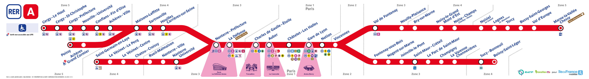

# Dashboard des incidents du RER A
Bienvenue sur la page du projet ayant pour but d'avoir des informations et statistiques détaillées sur les incidents ayant lieu sur les voies du RER A.

## Expliquation
Ce projet a pour but de faire une étude complète et détaillée des incidents ayant lieu sur les voies du RER A, autant sur la typologie des incidents que sur le temps de réponse à incidents.

Il est possible de voir les périodes de l'année ayant le plus d'incidents (ou d'un type d'incident spécifique), et voir si le temps de réponse à incidents évolue au cours de l'année en fonction de l'affluence supposée.

> Typologie de l'incident : correspond au type intrinsèque d'un incident ayant lieu, par exemple ici les incidents de type bagage ou malaise auront la typologie "voyageur"

> Temps de réponse à incidents : correspond au temps écoulé entre le moment où un incident survient et le moment où l'incident est résolu soit lorsque le trafic n'est plus impacté

Le projet utilise les données présentes sur les tweets du compte officiel du RER A ([lien vers le compte officiel Twitter/X](https://x.com/RER_A)).

> **Attention /!\ - Tous les nombres et statistiques indiqués sur le dashboard sont des ESTIMATIONS, et ne consituent en aucun cas des données exactes. Ce ne sont pas non plus des données officielles !**

Le dashboard s'inspirant de la charte graphique du RER A met à disposition différents outils et graphiques pour explorer ces données, pour que vous puissiez voir l'état du réseaux à des périodes de l'année et l'évolution au niveau des incidents.

## Comment l'utiliser ?
En l'état le dashboard est censé être hébergé sur ce lien : [METTRE LIEN]

Comme l'hébergement est fait sur une plateforme gratuite, il se peut que le lien ne marche plus, dans ce cas là il est possible de télécharger le projet localement.

Pour ca, il faut cloner le projet
[LIGNE DE COMMANDE]
Et une fois à la racine, il faut lancer le script contenant le dashboard
[LIGNE DE COMMANDE]

## Motivation
Pour être tout à fait honnête, l'incompréhension et le désespoir sont les 2 principales motivations derrière ce projet.
Quand on voit que certains incidents ayant lieu à un bout de la ligne paralysent l'entièreté du trafic pendant des durées aberrantes à des horaires de pointes, c'est assez gênant et déprimant.

Et c'est comme ça que petit à petit, j'avais de plus en plus envie de savoir, qu'est ce qui était la cause majoritaire des incidents ? L'affluence a-t-elle une réelle corrélation avec l'occurrences des incidents (car les incidents surviennent autant à 8h qu'à 1h du matin) ?

Je me suis donc lancé dans ce projet d'analyser les incidents du RER A et le temps de réponse à incidents. _(Le projet m'aura pris du temps car la flemme est pasée par là...)_

## Détails techniques
Le projet a entièrement réalisé en utilisant Python, allant de la récolte à l'analyse des données à leur mise en forme sous graphiques.

### Librairies
Pour la récolte des données, c'est Selenium qui a été utilisé pour faciliter la récolte, au vues des mesures prises par le site pour annuler les robots de scraping.

Pour tout ce qui est traitement des données, globalement il y a Pandas pour la mise en forme et NLTK pour toutes les opérations de NLP.

Et enfin pour le dashboard, c'est Dash qui a été utilisé.

### Hébergement du Dashboard
Comme il n'existe pas beaucoup de solution gratuite pour héberger des dashbaord Dash non statiques, j'ai utilisé PythonEverywhere. Mais le compte gratuit a pas mal de restriction, donc il se peut que l'hébergement ne fonctionne plus, mais pas de soucis vous pouvez l'exécuter en local.

## Disclaimer
Je préfère le redire mais : tous les chiffres présentés autant dans mes dire que dans le dashboard sont des estimations, puisque les données utilisées ne sont pas officielles mais seulement récupérer par un intermédiaire. Même si ces estimations peuvent donner une idée générale, elles ne sont en aucun cas des faits avérés.

## Améliorations possible
Les principales améliorations à faire sont sur la récupération des données, qui viennent fausser le calcul du temps de réponse à incident.

- Tweets non issus du thread qui sont récupérés
- La récupération des réponses récupère parfois des tweets du RER A répondant à des gens ayant supprimer leur tweet
- Gestion des citations trop ambivalente (temps de réponse négatif)

