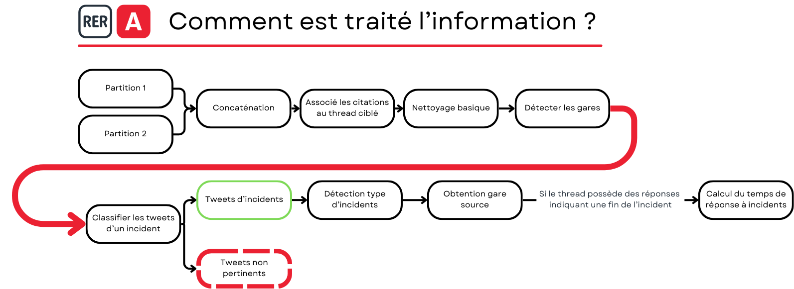
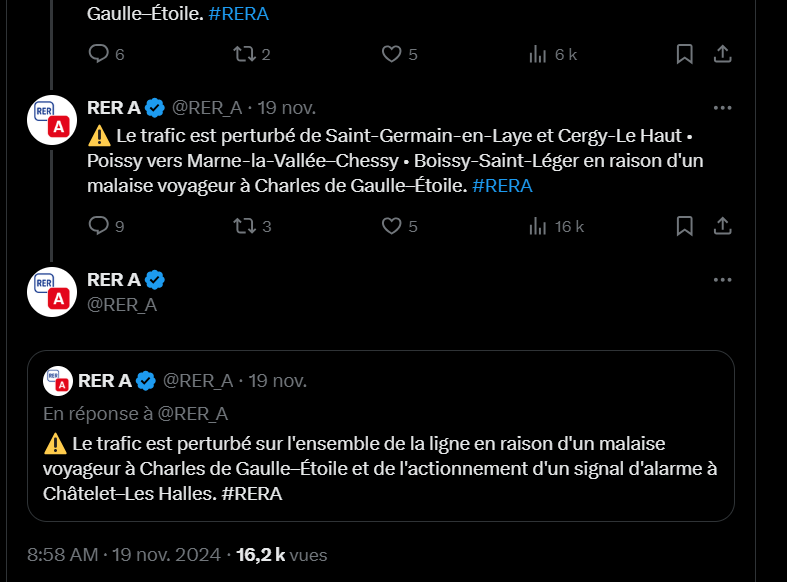
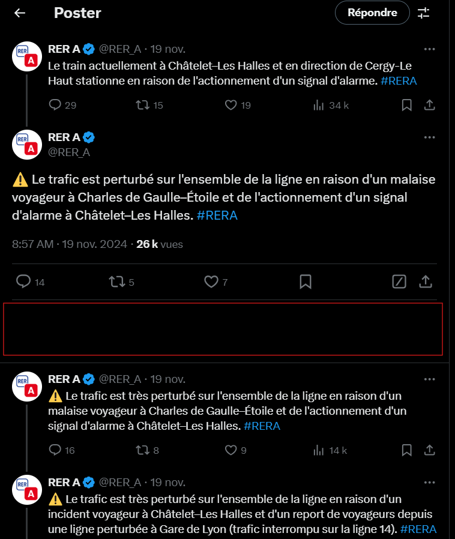

# Analyse des tweets du RER A

Cette partie a pour but d'analyser les données récoltées par le scraper. Pour rappel, le scraper récupère les tweets du compte du RER A, sans distinction, et parmi cette masse de tweet certains vont être utile pour avoir des informations sur les incidents d'autres non, c'est tout l'enjeu de cette partie.

Il va y avoir une descripton de chacune des grosses étapes qui peuvent être retrouvées sur le schéma suivant :

# Etapes principales d'analyses
##  Gestion des citations
Dans la récupération de données, les citations étaient telles que les date des tweets cités étaient récupérés avec une formulation uniques. L'intérêt de ces citations est de reprndre un flux d'informations au lieu de le réécrire, ainsi un incident mentionné par citation fera référence à l'incident cité, l'idée va donc être de récupérer le threadid du tweet cité et l'associé à celui de la citation, puisque la citation fait référence à ce tweet. Et dans le cas d'un incident, ca fait référence au même incident, pour soit ajouter de l'information ou apporter une autre conclusion.

Etant donné qu'on possède la date de publication du tweet cité on peut facilement le retrouver dans ce qui a été récupéré (en partant du principe que l'intégralité des tweet a été récupérée sinon une erreur sera générée car le tweet cité n'apparait dans la base).

    
    

## Les gares
### Création du référentiel des gares
### Trouver la gare source du problème
## Les incidents
### Détecter les incidents
### Calculer le temps de résolution