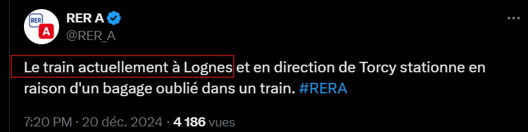

# Analyse des tweets du RER A

Cette partie a pour but d'analyser les données récoltées par le scraper. Pour rappel, le scraper récupère les tweets du compte du RER A, sans distinction, et parmi cette masse de tweet certains vont être utile pour avoir des informations sur les incidents d'autres non, c'est tout l'enjeu de cette partie.

Il va y avoir une descripton de chacune des grosses étapes qui peuvent être retrouvées sur le schéma suivant :

# Etapes principales d'analyses
##  Gestion des citations
Dans la récupération de données, les citations étaient telles que les date des tweets cités étaient récupérés avec une formulation uniques. L'intérêt de ces citations est de reprndre un flux d'informations au lieu de le réécrire, ainsi un incident mentionné par citation fera référence à l'incident cité, l'idée va donc être de récupérer le threadid du tweet cité et l'associé à celui de la citation, puisque la citation fait référence à ce tweet. Et dans le cas d'un incident, ca fait référence au même incident, pour soit ajouter de l'information ou apporter une autre conclusion.

Etant donné qu'on possède la date de publication du tweet cité on peut facilement le retrouver dans ce qui a été récupéré (en partant du principe que l'intégralité des tweet a été récupérée sinon une erreur sera générée car le tweet cité n'apparait dans la base).

    
    

## Les gares
### Création du référentiel des gares
La deuxième grande étape de l'analyse est de pouvoir détecter les gares mentionnées dans un tweet. Bien heuresement, la plupart du temps les gares sont écrites tels qu'on les connaît, mais pas pour toutes. S'il est facile de retrouver une gare comme "La Défense", cela devient plus compliqué pour "Saint Maur Créteil", puisque cela peut aussi s'écrire "St Maur Créteil". Il va donc être nécessaire de créer un référentiel qui à chaque associe une orthographe sous laquelle on pourra la trouver, cette phase d'observation se fait par itération pour découvrir toutes les syntaxes possibles.

Aussi, comme les tweets sont des données plutot structurées, on suppose qu'il n'y aura pas une infinité d'orthographe possible pour chaque gare. La pire situation possible este l'erreur d'orthoraphe, mais elles sont assez peu courantes.

### Trouver la gare source du problème

Une fois le référentiel de gare établit on peut passer à l'étape suivante : trouver la gare où l'incident se produit. L'avantage d'avoir pris le cas du RER A c'est que les tweets du compte seront structrés en général, ils vont respecter des formulations, des mots...
Donc très souvent, pour annoncer un incident ainsi que la gare où il se produit il y aura un nombre limité de formulation possible, et ces formulations sont très reconnaissables.

    
    
    
    

Il suffit de capturer ces formulations, les traduire en REGEX et le tour est joué, puisque ces formulations permettent d'obtenir la gare où l'incident se produit. 
Combiné avec le référentiel précédemment créé, on peut donc détecter sur chaque tweet la gare où un incident se produit.

## Les incidents
La dernière grande étape est de détecter le type d'incidents mentionner dans un tweet, puisqu'on possède déjà la/les gares présentes mentionnées. 

### Détecter les incidents
De la même manière que pour les gares, les typologies d'incidents sont récurrentes d'un tweet à l'autre, et ont très souvent les mêmes mots. Ici comme les typologies sont nombreuses, et les associées individuellement serait perdre de l'information, on va donc créer un référentiel pour les grandes familles d'incidents et dedans on met les mots des incidents qui reviennent le plus souvent.

Par exemple, pour l'incident de type "bagage oublié" les mots revenant le plus souvent pour qualifier cet incidents seront : "bagage oublie" et "bagages oublies". En faisant pour chaque incidents et en les mettant dans des groupes les rassemblant, on peut facilement prendre tous les incidents existant. Encore une fois, comme les tweets sont plutot structurés, on peut facilement itérer à la main dessus.

Dès qu'un tweet contiendra les mots d'une liste, on associe la famille d'incident à ce tweet, rien de bien difficile.

### Calculer le temps de résolution
La dernière étape de cette analyse est de calculer le temps de réponse à incident. Maintenant qu'on possède la gare source et le type d'incident d'un tweet, calculer le temps de réponse devient plus simple.

Pour chaque tweet contenant un incident, on va aller chercher son thread associé, et chercher parmi les réponses celle qui sont susceptible de contenir un texte mentionnant la résolution ou la fin d'un incident. Si un thread contient une réponse contenant un tel texte, cela veut dire que l'incident est résolu, ainsi le temps entre le tweet mentionnant l'incident et sa réponse de clôture correspondra au temps de réponse à incident.

Et pour tous les tweets ne possédant pas de réponse mentionannt la fin de l'incident, on ne prendra rien.

# Détails supplémentaires
Pour avoir des infos supplémentaires sur chacune des étapes ou traitements, tout est fait dans le Notebook.