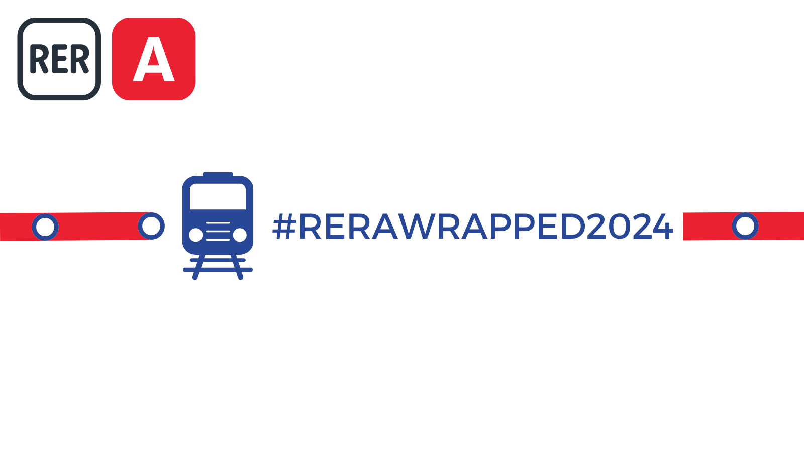
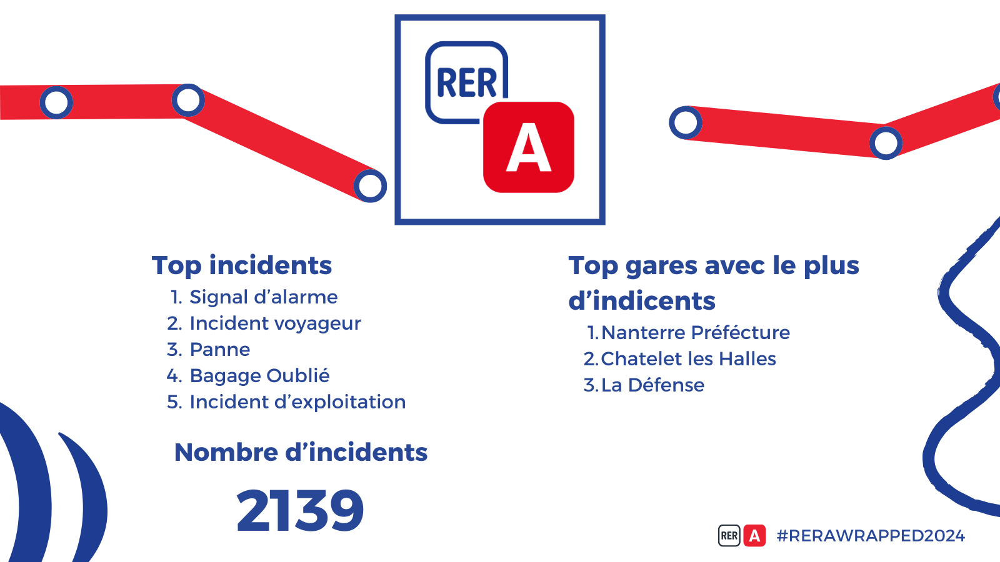

# Les WRAPPED du RER A 2024

J'ai saisi l'opportunité de la tendance des wrapped Spotify pour faire ceux du RER A. Je pense que le format se portait extrêmement bien pour ce projet d'analyse d'incidents et du temps de réponse, pour faire des stats et présenter les résultats sur l'année.

Avec Canva et un peu de temps, voilà le résultat !

## #RERAWRAPPED2024

---

---

---

---

---

---

---

---

---

---

        

        

---
