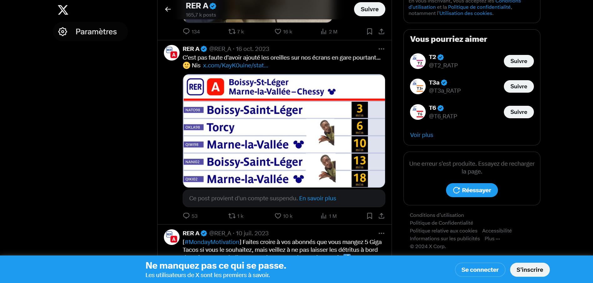
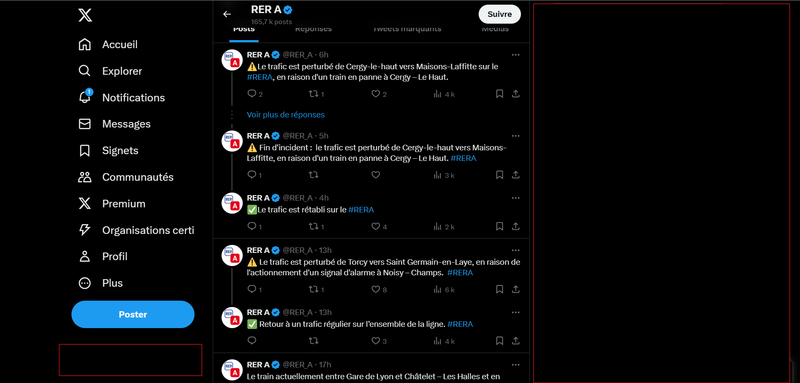
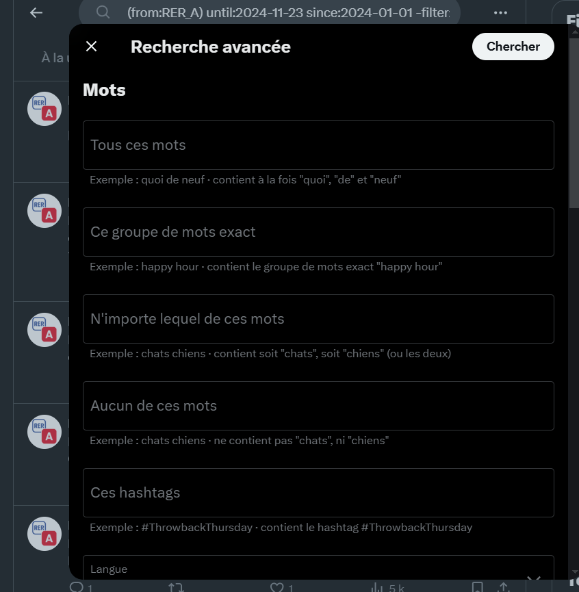
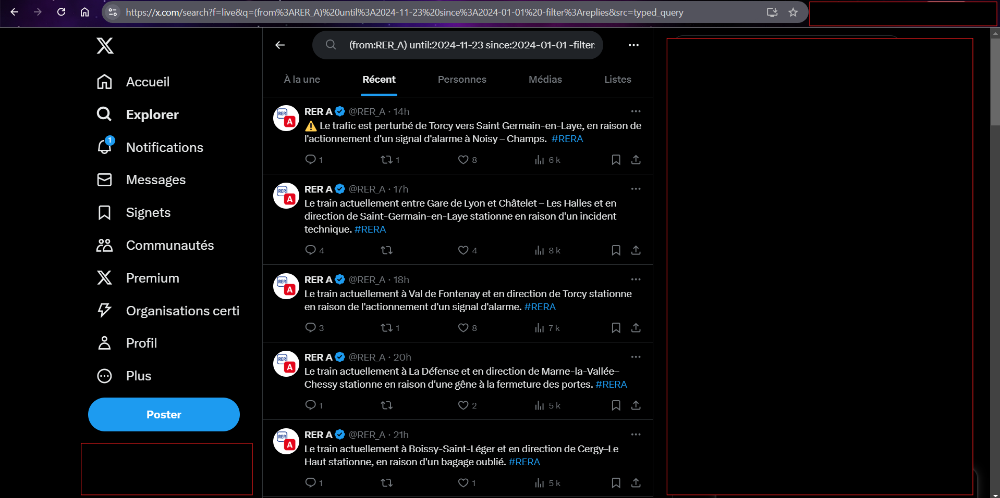
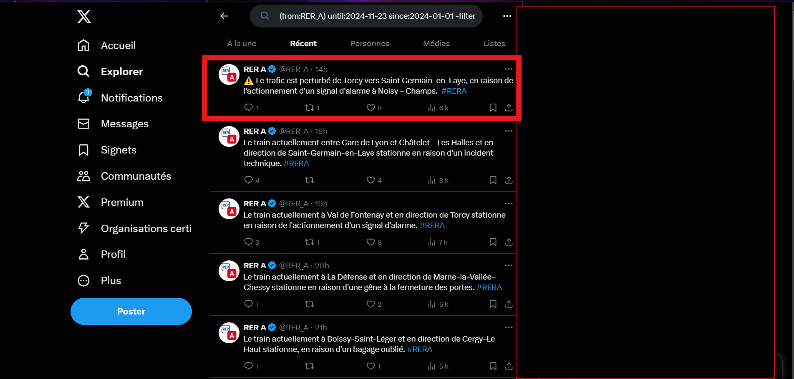
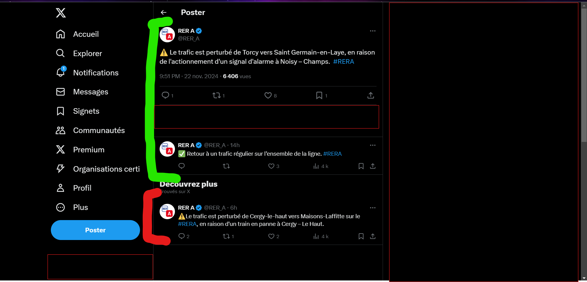

# Comment lancer le scraping ?
Les choses ont été simplifiées de telle sorte que tout peut être exécuté à partir du fichier <code>main</code> tel que :
```
python main.py
```

Dedans il faut renseigné le @ du compte, la date de début des tweet à récupérer et la date de fin (la période de récupération à couvrir).

<p align="center" width="100%">
     
</p>

## Et les résultats du scraping ?
Les résultats sont sauvegardés à chaque item récupérés dans le répertoire <code>data</code>.

# Comment marche le scraping ?

## Trouver les tweets
Ici pour récupérer les informations sur les tweets et thread, c'est Selenium qui est utilisé pour simuler un comportement utilisateur, à des fins de simplicité.

Tout d'abord, le processus va vérifier qu'un utilisateur est connecté, car sans être connecté il est impossible par exemple de voir l'intégralité des posts d'un compte, même en allant sur sa page. Les seuls tweets apparaissant seront ceux ayant faits le plus réagir ou ceux ayant le plus de stats, ce qui ne nous intéresse pas.

<p align="center" width="100%">
     
</p>


C'est pour cette raison que le scraping ne commencera pas tant qu'un profil n'est pas connecté. Et pour vérifier qu'un utilisateur est connecté, c'est la photo de profil qui est recherché en bas à gauche de l'écran.

<p align="center" width="100%">
     
</p>


Une fois le profil connecté, on peut voir la quasi intégralité des tweets d'un profil. Effectivement en cliquant sur le compte recherché, seuls les 3200 dernier tweets apparaissent, ce qui pourrait être assez dans certains cas, mais pas ici. Comme on recherche l'intégralité de l'historique des incidents du RER A, on peut supposer que cela va largement dépasser les 3200 derniers tweets. La solution à ce moment là pour aller au delà de la limite, c'est d'utiliser la recherche avancée.

La recherche avancée est un outil mis à disposition par Twitter pour trouver des tweets spécifiques ou en appliquant des règles particulières.


<p align="center" width="100%">
     
</p>

Et ce qui est génial c'est que dedans on va pouvoir renseigner : le compte écrivant les tweets, une plage de date durant laquelle les tweets ont été postés. Avec ca, il est facile d'avoir accès au tweets du compte du RER A allant du 1er Janvier 2024 à maintenant. Problème est que, le comtpe du RER A ne tweet pas uniquement sur les incidents, mais répondent aussi aux utilisateurs. Pour cela, dans la recherche avancée on va mentionner qu'on ne veut garder que les tweets et exclure les retweet et réponse, de cette manière on ne garde que l'information provenant du RER A, garantissant un minimum sa pertinence, les tris se faisant plus tard.



Le résultat de la recherche avancée est un URL qui nous permettra d'accéder aux résultats de cette requête.

## Récupérer l'information
En envoyant Selenium sur l'URL issu de la recherche avancée, il ne manque plus qu'à récupérer les informations des tweets.
A noter, que ici on a accès uniquement aux tweets et pas aux réponses. Car si par exemple ici on aura des tweets mentionnant des incidents ayant lieu, il n'y aura pas la date de fin des incidents. Le compte du RER A a pour habitude de parler dans un incidents dans un tweet, et ensuite en répondant à ce même tweet, donne des nouvelles sur la réoslution de l'incidents.

Ainsi pour avoir accès aux résolution d'un incidents, il faut accéder au thread associé, et donc cliquer sur le tweet.

<p align="center" width="100%">
     
</p>



Une fois cliqué sur le tweet en question, le thread se déroule et tous les tweet associés apparaissent. A ce moment là, il faudra s'assurer que tous les tweet ne sont pas pris, mais uniquement ceux du thread.

<p align="center" width="100%">
     
</p>


## Récupérer l'information des tweets
Si jusqu'à maintenant la procédure macro a été décrite, et qui peut etre résumé de la sorte :

- Vérifier qu'un profil est connecté
- Faire une recherche avancée selon les paramètres voulus
- Pour chaque tweet en résultats
    - Cliquer sur le tweet (pour accéder au thread)
    - Récupérer les informations de tous les tweet au thread associés
    - Revenir en arrière
    - Cliquer sur le tweet suivant (et ainsi de suite)

Pour récupérer les informations contenus dans un tweet (date de publication, nb likes, nb commentaires...), c'est avant tout de la lecture/requête de HTML. Je ne vais pas rentrer dans les détails forcément, le code parlera plus de lui même.

Juste à savoir que en requêtant avec Xpath, les choses assez facile d'accès et il est aisé de conditionner certaines récupérations.

## 2 versions de scraping
Il y a effectivement 2 versions pour scraper : <code>scraper.py</code> et <code>scraper_answers.py</code>.

La première version va faire la recherche avancée sur les tweets écris du compte, cliquer dessus pour accéder au thread et extraire les réponses.

La deuxième version, va faire la recherche avancée sur toutes les réponses des thread, cliquer dessus pour accéder au thread et extraire les réponses et tweet original. La différence se fait au niveau de l'extraction, car certains thread s'apparente des VN avec plusieurs routes par moment, routes impossible à capturer avec la première version, alors que la deuxième garantit une extraction complète d'un thread peut importe les routes.